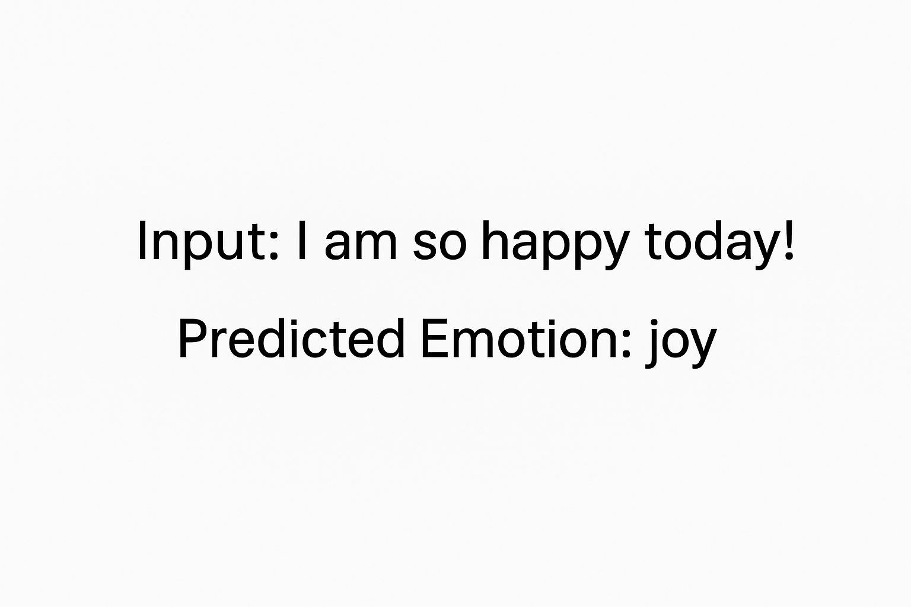

TanmayAI is a machine learning model that classifies human emotions from text.
It uses a Naive Bayes classifier with Bag-of-Words vectorization to identify emotions such as joy, anger, sadness, fear, and more from textual input.

⚙️ Installation

Clone the repository and install the dependencies.

git clone https://github.com/tanmayfatale-code/Emotion-Detection.git
cd Emotion-Detection
pip install -r requirements.txt

If you don’t have a requirements.txt, manually install:

pip install pandas scikit-learn

🚀 Usage

Open the Jupyter Notebook:

jupyter notebook TanmayAI.ipynb

Make sure your dataset file train.txt is in the same folder.
It should have text data and corresponding emotion labels (e.g., happy, sad, angry, etc.).

Run all the cells in the notebook to:

Load and clean the dataset

Vectorize the text using CountVectorizer

Train the Naive Bayes model

Test predictions

### 🖼️ Example Output
Here’s a sample prediction made by the model:

